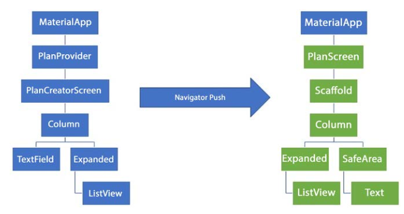

Nama  : Mutiara Devita Eka Putri
Kelas : TI 3G
NIM   : 2141720135
Absen : 18

# Praktikum 1
- Tugas Praktikum 1: Dasar State dengan Model-View
1. Selesaikan langkah-langkah praktikum tersebut, lalu dokumentasikan berupa GIF hasil akhir praktikum beserta penjelasannya di file README.md! Jika Anda menemukan ada yang error atau tidak berjalan dengan baik, silakan diperbaiki.

2. Jelaskan maksud dari langkah 4 pada praktikum tersebut! Mengapa dilakukan demikian?
Jawab : Langkah 4 berfungsi untuk mengekspor kode pada plan.dart dan task.dart sehingga pada plan_screen.dart hanya mengimport file data_layer.dart saja untuk mengimpor kedua file tersebut.

3. Mengapa perlu variabel plan di langkah 6 pada praktikum tersebut? Mengapa dibuat konstanta ?
Jawab : Variabel plan digunakan untuk menginisialisasikan class Plan yang telah dibuat pada plan.dart. pada langkah tersebut dibuat konstanta agar variabel tersebut tidak dapat diubah nilainya.

4. Lakukan capture hasil dari Langkah 9 berupa GIF, kemudian jelaskan apa yang telah Anda buat!

5. Apa kegunaan method pada Langkah 11 dan 13 dalam lifecyle state ?
Jawab : Fungsi initstate yaitu untuk menginisialisasi state pada widget. Sedangkan fungsi dispose yaitu untuk membersihkan state pada widget.

6. Kumpulkan laporan praktikum Anda berupa link commit atau repository GitHub ke spreadsheet yang telah disediakan!

# Praktikum 2
- Tugas Praktikum 2: InheritedWidget
1. Selesaikan langkah-langkah praktikum tersebut, lalu dokumentasikan berupa GIF hasil akhir praktikum beserta penjelasannya di file README.md! Jika Anda menemukan ada yang error atau tidak berjalan dengan baik, silakan diperbaiki sesuai dengan tujuan aplikasi tersebut dibuat.

2. Jelaskan mana yang dimaksud InheritedWidget pada langkah 1 tersebut! Mengapa yang digunakan InheritedNotifier?
Jawab : InheritedWidget adalah sebuah widget khusus yang dapat digunakan untuk membagikan dan memperbarui data lintas widget tree tanpa perlu melewati data tersebut secara eksplisit melalui parameter konstruktor widget. InheritedWidget adalah cara untuk membagikan satu objek ke dalam seluruh subtree widget secara efisien. InheritedNotifier digunakan untuk mengakses data dari widget lainnya dan dapat memberitahu widget lainnya jika terjadi perubahan data.

3. Jelaskan maksud dari method di langkah 3 pada praktikum tersebut! Mengapa dilakukan demikian?
Jawab : Terdapat dua metode yang digunakan pada langkah 3, yaitu completedCount dan completenessMessage. completedCount adalah getter method yang menghitung jumlah tugas (tasks) yang sudah selesai (complete). Sedangkan completenessMessage adalah getter method yang mengembalikan pesan string yang menyatakan seberapa banyak tugas yang sudah selesai dari total jumlah tugas. Mengapa dilakukan demikian karena Metode completedCount memberikan informasi konkret tentang berapa banyak tugas yang sudah selesai dan Metode completenessMessage memberikan pesan string yang dapat langsung digunakan untuk memberikan umpan balik kepada pengguna atau menampilkan informasi ke dalam antarmuka pengguna.

4. Lakukan capture hasil dari Langkah 9 berupa GIF, kemudian jelaskan apa yang telah Anda buat!

5. Kumpulkan laporan praktikum Anda berupa link commit atau repository GitHub ke spreadsheet yang telah disediakan!

# Praktikum 3
- Tugas Praktikum 3: State di Multiple Screens
1. Selesaikan langkah-langkah praktikum tersebut, lalu dokumentasikan berupa GIF hasil akhir praktikum beserta penjelasannya di file README.md! Jika Anda menemukan ada yang error atau tidak berjalan dengan baik, silakan diperbaiki sesuai dengan tujuan aplikasi tersebut dibuat.
2. Berdasarkan Praktikum 3 yang telah Anda lakukan, jelaskan maksud dari gambar diagram berikut ini!

Jawab : Diagram widget tree sebelah kiri mencerminkan struktur aplikasi saat sedang berada dalam proses pembuatan rencana baru. Pada tahap ini, pengguna berinteraksi dengan PlanCreatorScreen, di mana mereka dapat membuat rencana baru. Data rencana dan tampilan daftar rencana diatur oleh PlanProvider, yang menjadi bagian dari widget tree di bawah MaterialApp. Sebagai bagian dari tata letak, terdapat Column yang berisi TextField dan Expanded untuk menata secara vertikal dan memanfaatkan ruang yang ada.

Sementara itu, diagram widget tree sebelah kanan merepresentasikan tampilan utama (PlanScreen) setelah navigasi atau perubahan rute. Di sini, pengguna dapat melihat daftar rencana yang ada. Data rencana juga dikelola oleh PlanProvider, yang tetap berada di root widget tree untuk memungkinkan akses lintas tampilan. Column, Expanded, dan SafeArea digunakan untuk menyusun elemen-elemen dengan optimal, termasuk ListView untuk menampilkan daftar rencana. Selain itu, terdapat elemen Text di bawah SafeArea yang mungkin menampilkan pesan tentang kelengkapan rencana.

Navigasi antara kedua diagram ini terjadi saat pengguna berpindah antara langkah-langkah pembuatan rencana (PlanCreatorScreen) dan melihat rencana yang ada (PlanScreen).

3. Lakukan capture hasil dari Langkah 14 berupa GIF, kemudian jelaskan apa yang telah Anda buat!

4. Kumpulkan laporan praktikum Anda berupa link commit atau repository GitHub ke spreadsheet yang telah disediakan!